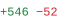
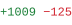
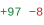
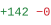
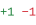

### Abstract

I'm **Phu**. I work on computer vision and build the systems around it.

### Contributions

<!-- os:start -->

 <a href="https://github.com/roboflow/rf-detr/pulls?q=is%3Apr+is%3Amerged+author%3Althphuw"><picture><source media="(min-width: 601px)" srcset="https://raw.githubusercontent.com/lthphuw/lthphuw/main/assets/blank.svg"></picture></a><a href="https://github.com/roboflow/rf-detr/pulls?q=is%3Apr+is%3Amerged+author%3Althphuw"><picture><source media="(max-width: 600px)" srcset="https://raw.githubusercontent.com/lthphuw/lthphuw/main/assets/blank.svg"></picture></a> 

<a href="https://github.com/roboflow/rf-detr/pull/1561"><code>#1561</code></a>&nbsp;&nbsp;|&nbsp; fix(training): record <code>args</code> and <code>model_config</code> in <code>last.ckpt</code> and interval checkpoints <a href="https://github.com/roboflow/rf-detr/pull/1561/files"><picture><source media="(min-width: 601px)" srcset="https://raw.githubusercontent.com/lthphuw/lthphuw/main/assets/blank.svg"></picture></a><a href="https://github.com/roboflow/rf-detr/pull/1561/files"><picture><source media="(max-width: 600px)" srcset="https://raw.githubusercontent.com/lthphuw/lthphuw/main/assets/blank.svg"></picture></a> 

<a href="https://github.com/roboflow/rf-detr/pull/1556"><code>#1556</code></a>&nbsp;&nbsp;|&nbsp; fix(export): check export arguments and packages before the forward pass <a href="https://github.com/roboflow/rf-detr/pull/1556/files"><picture><source media="(min-width: 601px)" srcset="https://raw.githubusercontent.com/lthphuw/lthphuw/main/assets/blank.svg"></picture></a><a href="https://github.com/roboflow/rf-detr/pull/1556/files"><picture><source media="(max-width: 600px)" srcset="https://raw.githubusercontent.com/lthphuw/lthphuw/main/assets/blank.svg"></picture></a> 

<a href="https://github.com/roboflow/rf-detr/pull/1551"><code>#1551</code></a>&nbsp;&nbsp;|&nbsp; fix(datasets): decode non-JPEG training images without a NumPy round trip <a href="https://github.com/roboflow/rf-detr/pull/1551/files"><picture><source media="(min-width: 601px)" srcset="https://raw.githubusercontent.com/lthphuw/lthphuw/main/assets/blank.svg"></picture></a><a href="https://github.com/roboflow/rf-detr/pull/1551/files"><picture><source media="(max-width: 600px)" srcset="https://raw.githubusercontent.com/lthphuw/lthphuw/main/assets/blank.svg"></picture></a> 

<a href="https://github.com/roboflow/rf-detr/pull/1546"><code>#1546</code></a>&nbsp;&nbsp;|&nbsp; fix(export): check TRTInference inputs, TensorRT failures and its device <a href="https://github.com/roboflow/rf-detr/pull/1546/files"><picture><source media="(min-width: 601px)" srcset="https://raw.githubusercontent.com/lthphuw/lthphuw/main/assets/blank.svg"></picture></a><a href="https://github.com/roboflow/rf-detr/pull/1546/files"><picture><source media="(max-width: 600px)" srcset="https://raw.githubusercontent.com/lthphuw/lthphuw/main/assets/blank.svg"></picture></a> 

<a href="https://github.com/roboflow/rf-detr/pull/1543"><code>#1543</code></a>&nbsp;&nbsp;|&nbsp; fix(models): reload the trained backbone from a <code>backbone_lora=True</code> checkpoint <a href="https://github.com/roboflow/rf-detr/pull/1543/files"><picture><source media="(min-width: 601px)" srcset="https://raw.githubusercontent.com/lthphuw/lthphuw/main/assets/blank.svg"></picture></a><a href="https://github.com/roboflow/rf-detr/pull/1543/files"><picture><source media="(max-width: 600px)" srcset="https://raw.githubusercontent.com/lthphuw/lthphuw/main/assets/blank.svg"></picture></a> 

<a href="https://github.com/roboflow/rf-detr/pulls?q=is%3Apr+is%3Amerged+author%3Althphuw">+9 more →</a>

 <a href="https://github.com/roboflow/trackers/pulls?q=is%3Apr+is%3Amerged+author%3Althphuw"><picture><source media="(min-width: 601px)" srcset="https://raw.githubusercontent.com/lthphuw/lthphuw/main/assets/blank.svg"></picture></a><a href="https://github.com/roboflow/trackers/pulls?q=is%3Apr+is%3Amerged+author%3Althphuw"><picture><source media="(max-width: 600px)" srcset="https://raw.githubusercontent.com/lthphuw/lthphuw/main/assets/blank.svg"></picture></a> 

<a href="https://github.com/roboflow/trackers/pull/614"><code>#614</code></a>&nbsp;&nbsp;|&nbsp;   fix(ocsort): encode ORU virtual boxes with <code>bbox_to_measurement</code> for XCYCWH <a href="https://github.com/roboflow/trackers/pull/614/files"><picture><source media="(min-width: 601px)" srcset="https://raw.githubusercontent.com/lthphuw/lthphuw/main/assets/blank.svg"></picture></a><a href="https://github.com/roboflow/trackers/pull/614/files"><picture><source media="(max-width: 600px)" srcset="https://raw.githubusercontent.com/lthphuw/lthphuw/main/assets/blank.svg"></picture></a> 

<a href="https://github.com/roboflow/trackers/pull/613"><code>#613</code></a>&nbsp;&nbsp;|&nbsp; fix(base): reject non-finite boxes before <code>update()</code> mutates  tracker state <a href="https://github.com/roboflow/trackers/pull/613/files"><picture><source media="(min-width: 601px)" srcset="https://raw.githubusercontent.com/lthphuw/lthphuw/main/assets/blank.svg"></picture></a><a href="https://github.com/roboflow/trackers/pull/613/files"><picture><source media="(max-width: 600px)" srcset="https://raw.githubusercontent.com/lthphuw/lthphuw/main/assets/blank.svg"></picture></a> 

 <a href="https://github.com/sunsmarterjie/yolov12/pulls?q=is%3Apr+is%3Amerged+author%3Althphuw"><picture><source media="(min-width: 601px)" srcset="https://raw.githubusercontent.com/lthphuw/lthphuw/main/assets/blank.svg"></picture></a><a href="https://github.com/sunsmarterjie/yolov12/pulls?q=is%3Apr+is%3Amerged+author%3Althphuw"><picture><source media="(max-width: 600px)" srcset="https://raw.githubusercontent.com/lthphuw/lthphuw/main/assets/blank.svg"></picture></a> 

<a href="https://github.com/sunsmarterjie/yolov12/pull/174"><code>#174</code></a>&nbsp;&nbsp;|&nbsp; Fix DataLoader collate crash when a batch mixes background and labelled images <a href="https://github.com/sunsmarterjie/yolov12/pull/174/files"><picture><source media="(min-width: 601px)" srcset="https://raw.githubusercontent.com/lthphuw/lthphuw/main/assets/blank.svg"></picture></a><a href="https://github.com/sunsmarterjie/yolov12/pull/174/files"><picture><source media="(max-width: 600px)" srcset="https://raw.githubusercontent.com/lthphuw/lthphuw/main/assets/blank.svg"></picture></a> 

<!-- os:end -->
