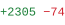
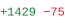
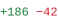

### Abstract

I'm **Phu**. I work on computer vision and build the systems around it.

### Contributions

<!-- os:start -->

 <a href="https://github.com/roboflow/rf-detr/pulls?q=is%3Apr+is%3Amerged+author%3Althphuw"><picture><source media="(min-width: 601px)" srcset="https://raw.githubusercontent.com/lthphuw/lthphuw/main/assets/blank.svg"></picture></a><a href="https://github.com/roboflow/rf-detr/pulls?q=is%3Apr+is%3Amerged+author%3Althphuw"><picture><source media="(max-width: 600px)" srcset="https://raw.githubusercontent.com/lthphuw/lthphuw/main/assets/blank.svg"></picture></a> 

<a href="https://github.com/roboflow/rf-detr/pull/1583"><code>#1583</code></a>&nbsp;&nbsp;|&nbsp; perf(export): replay the TensorRT launch from a CUDA graph with <code>TRTInference(cuda_graph=True)</code> <a href="https://github.com/roboflow/rf-detr/pull/1583/files"><picture><source media="(min-width: 601px)" srcset="https://raw.githubusercontent.com/lthphuw/lthphuw/main/assets/blank.svg"></picture></a><a href="https://github.com/roboflow/rf-detr/pull/1583/files"><picture><source media="(max-width: 600px)" srcset="https://raw.githubusercontent.com/lthphuw/lthphuw/main/assets/blank.svg"></picture></a> 

<a href="https://github.com/roboflow/rf-detr/pull/1581"><code>#1581</code></a>&nbsp;&nbsp;|&nbsp; feat(export): describe a TensorRT engine in a <code>&lt;engine&gt;.json</code> sidecar <a href="https://github.com/roboflow/rf-detr/pull/1581/files"><picture><source media="(min-width: 601px)" srcset="https://raw.githubusercontent.com/lthphuw/lthphuw/main/assets/blank.svg"></picture></a><a href="https://github.com/roboflow/rf-detr/pull/1581/files"><picture><source media="(max-width: 600px)" srcset="https://raw.githubusercontent.com/lthphuw/lthphuw/main/assets/blank.svg"></picture></a> 

<a href="https://github.com/roboflow/rf-detr/pull/1580"><code>#1580</code></a>&nbsp;&nbsp;|&nbsp; feat(export): build hardware- and version-compatible TensorRT engines <a href="https://github.com/roboflow/rf-detr/pull/1580/files"><picture><source media="(min-width: 601px)" srcset="https://raw.githubusercontent.com/lthphuw/lthphuw/main/assets/blank.svg"></picture></a><a href="https://github.com/roboflow/rf-detr/pull/1580/files"><picture><source media="(max-width: 600px)" srcset="https://raw.githubusercontent.com/lthphuw/lthphuw/main/assets/blank.svg"></picture></a> 

<a href="https://github.com/roboflow/rf-detr/pull/1579"><code>#1579</code></a>&nbsp;&nbsp;|&nbsp; perf(export): reuse TensorRT kernel timings across exports with <code>trt_timing_cache</code> <a href="https://github.com/roboflow/rf-detr/pull/1579/files"><picture><source media="(min-width: 601px)" srcset="https://raw.githubusercontent.com/lthphuw/lthphuw/main/assets/blank.svg"></picture></a><a href="https://github.com/roboflow/rf-detr/pull/1579/files"><picture><source media="(max-width: 600px)" srcset="https://raw.githubusercontent.com/lthphuw/lthphuw/main/assets/blank.svg"></picture></a> 

<a href="https://github.com/roboflow/rf-detr/pull/1604"><code>#1604</code></a>&nbsp;&nbsp;|&nbsp; fix(export): convert fp16 CoreML bundles for iOS 15 to keep Neural Engine accuracy <a href="https://github.com/roboflow/rf-detr/pull/1604/files"><picture><source media="(min-width: 601px)" srcset="https://raw.githubusercontent.com/lthphuw/lthphuw/main/assets/blank.svg"></picture></a><a href="https://github.com/roboflow/rf-detr/pull/1604/files"><picture><source media="(max-width: 600px)" srcset="https://raw.githubusercontent.com/lthphuw/lthphuw/main/assets/blank.svg"></picture></a> 

<a href="https://github.com/roboflow/rf-detr/pulls?q=is%3Apr+is%3Amerged+author%3Althphuw">+14 more →</a>

 <a href="https://github.com/roboflow/trackers/pulls?q=is%3Apr+is%3Amerged+author%3Althphuw"><picture><source media="(min-width: 601px)" srcset="https://raw.githubusercontent.com/lthphuw/lthphuw/main/assets/blank.svg"></picture></a><a href="https://github.com/roboflow/trackers/pulls?q=is%3Apr+is%3Amerged+author%3Althphuw"><picture><source media="(max-width: 600px)" srcset="https://raw.githubusercontent.com/lthphuw/lthphuw/main/assets/blank.svg"></picture></a> 

<a href="https://github.com/roboflow/trackers/pull/614"><code>#614</code></a>&nbsp;&nbsp;|&nbsp;   fix(ocsort): encode ORU virtual boxes with <code>bbox_to_measurement</code> for XCYCWH <a href="https://github.com/roboflow/trackers/pull/614/files"><picture><source media="(min-width: 601px)" srcset="https://raw.githubusercontent.com/lthphuw/lthphuw/main/assets/blank.svg"></picture></a><a href="https://github.com/roboflow/trackers/pull/614/files"><picture><source media="(max-width: 600px)" srcset="https://raw.githubusercontent.com/lthphuw/lthphuw/main/assets/blank.svg"></picture></a> 

<a href="https://github.com/roboflow/trackers/pull/613"><code>#613</code></a>&nbsp;&nbsp;|&nbsp; fix(base): reject non-finite boxes before <code>update()</code> mutates  tracker state <a href="https://github.com/roboflow/trackers/pull/613/files"><picture><source media="(min-width: 601px)" srcset="https://raw.githubusercontent.com/lthphuw/lthphuw/main/assets/blank.svg"></picture></a><a href="https://github.com/roboflow/trackers/pull/613/files"><picture><source media="(max-width: 600px)" srcset="https://raw.githubusercontent.com/lthphuw/lthphuw/main/assets/blank.svg"></picture></a> 

 <a href="https://github.com/sunsmarterjie/yolov12/pulls?q=is%3Apr+is%3Amerged+author%3Althphuw"><picture><source media="(min-width: 601px)" srcset="https://raw.githubusercontent.com/lthphuw/lthphuw/main/assets/blank.svg"></picture></a><a href="https://github.com/sunsmarterjie/yolov12/pulls?q=is%3Apr+is%3Amerged+author%3Althphuw"><picture><source media="(max-width: 600px)" srcset="https://raw.githubusercontent.com/lthphuw/lthphuw/main/assets/blank.svg"></picture></a> 

<a href="https://github.com/sunsmarterjie/yolov12/pull/174"><code>#174</code></a>&nbsp;&nbsp;|&nbsp; Fix DataLoader collate crash when a batch mixes background and labelled images <a href="https://github.com/sunsmarterjie/yolov12/pull/174/files"><picture><source media="(min-width: 601px)" srcset="https://raw.githubusercontent.com/lthphuw/lthphuw/main/assets/blank.svg"></picture></a><a href="https://github.com/sunsmarterjie/yolov12/pull/174/files"><picture><source media="(max-width: 600px)" srcset="https://raw.githubusercontent.com/lthphuw/lthphuw/main/assets/blank.svg"></picture></a> 

<!-- os:end -->
