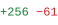
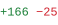
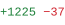

### Abstract

I'm **Phu**. I work on computer vision and build the systems around it.

### Featured

<!-- feat:start -->
**[INT8 quantization for RF-DETR on TensorRT](https://github.com/roboflow/rf-detr/pull/1595)**&nbsp;&nbsp;[`roboflow/rf-detr`](https://github.com/roboflow/rf-detr) Adds `export(format="tensorrt", quantization="int8")`. I place the **Q/DQ nodes myself** on the FP16 graph instead of using onnxruntime's quantizer, which pulled the graph back to FP32. The engine runs **1.10–1.33× faster** than FP16 for about 0.5–0.85 AP.

**[A faster TensorRT export and runtime](https://github.com/roboflow/rf-detr/pull/1583)**&nbsp;&nbsp;[`roboflow/rf-detr`](https://github.com/roboflow/rf-detr) A reusable kernel **timing cache** (a 38 s build drops to **8 s**), **hardware- and version-compatible engines**, a **JSON sidecar** that describes input, normalisation and outputs for C++ and Triton users, and **CUDA graph replay** that cuts about 40% off each call.

**[CoreML on the Neural Engine](https://github.com/roboflow/rf-detr/pull/1604)**&nbsp;&nbsp;[`roboflow/rf-detr`](https://github.com/roboflow/rf-detr) Measured exactly where Core ML leaves the ANE, then fixed fp16 exports losing about 3 AP there by converting for **iOS 15**: **45.06 → 48.04 AP**, matching PyTorch.

**[Real FP16 engines on TensorRT 11](https://github.com/roboflow/rf-detr/pull/1454)**&nbsp;&nbsp;[`roboflow/rf-detr`](https://github.com/roboflow/rf-detr) TensorRT 11 removed the FP16 flag, so fp16 builds quietly fell back to FP32. I **cast the ONNX graph** instead, and the engine comes out **1.87× smaller**.
<!-- feat:end -->

### Contributions

<!-- os:start -->

 <a href="https://github.com/roboflow/rf-detr/pulls?q=is%3Apr+is%3Amerged+author%3Althphuw"><picture><source media="(min-width: 601px)" srcset="https://raw.githubusercontent.com/lthphuw/lthphuw/main/assets/blank.svg"></picture></a><a href="https://github.com/roboflow/rf-detr/pulls?q=is%3Apr+is%3Amerged+author%3Althphuw"><picture><source media="(max-width: 600px)" srcset="https://raw.githubusercontent.com/lthphuw/lthphuw/main/assets/blank.svg"></picture></a> 

<a href="https://github.com/roboflow/rf-detr/pull/1612"><code>#1612</code></a>&nbsp;&nbsp;|&nbsp; test(export): make the ExecuTorch e2e parity tests tie-robust and cover the keypoint head <a href="https://github.com/roboflow/rf-detr/pull/1612/files"><picture><source media="(min-width: 601px)" srcset="https://raw.githubusercontent.com/lthphuw/lthphuw/main/assets/blank.svg"></picture></a><a href="https://github.com/roboflow/rf-detr/pull/1612/files"><picture><source media="(max-width: 600px)" srcset="https://raw.githubusercontent.com/lthphuw/lthphuw/main/assets/blank.svg"></picture></a> 

<a href="https://github.com/roboflow/rf-detr/pull/1609"><code>#1609</code></a>&nbsp;&nbsp;|&nbsp; feat(export): store <code>notes</code> and the RF-DETR version in CoreML <code>.mlpackage</code> metadata <a href="https://github.com/roboflow/rf-detr/pull/1609/files"><picture><source media="(min-width: 601px)" srcset="https://raw.githubusercontent.com/lthphuw/lthphuw/main/assets/blank.svg"></picture></a><a href="https://github.com/roboflow/rf-detr/pull/1609/files"><picture><source media="(max-width: 600px)" srcset="https://raw.githubusercontent.com/lthphuw/lthphuw/main/assets/blank.svg"></picture></a> 

<a href="https://github.com/roboflow/rf-detr/pull/1595"><code>#1595</code></a>&nbsp;&nbsp;|&nbsp; feat(export): build INT8 TensorRT engines with <code>quantization="int8"</code> <a href="https://github.com/roboflow/rf-detr/pull/1595/files"><picture><source media="(min-width: 601px)" srcset="https://raw.githubusercontent.com/lthphuw/lthphuw/main/assets/blank.svg"></picture></a><a href="https://github.com/roboflow/rf-detr/pull/1595/files"><picture><source media="(max-width: 600px)" srcset="https://raw.githubusercontent.com/lthphuw/lthphuw/main/assets/blank.svg"></picture></a> 

<a href="https://github.com/roboflow/rf-detr/pull/1589"><code>#1589</code></a>&nbsp;&nbsp;|&nbsp; refactor(export): remove the dead ONNX optimizer and the <code>[onnx]</code> packages only it used <a href="https://github.com/roboflow/rf-detr/pull/1589/files"><picture><source media="(min-width: 601px)" srcset="https://raw.githubusercontent.com/lthphuw/lthphuw/main/assets/blank.svg"></picture></a><a href="https://github.com/roboflow/rf-detr/pull/1589/files"><picture><source media="(max-width: 600px)" srcset="https://raw.githubusercontent.com/lthphuw/lthphuw/main/assets/blank.svg"></picture></a> 

<a href="https://github.com/roboflow/rf-detr/pull/1583"><code>#1583</code></a>&nbsp;&nbsp;|&nbsp; perf(export): replay the TensorRT launch from a CUDA graph with <code>TRTInference(cuda_graph=True)</code> <a href="https://github.com/roboflow/rf-detr/pull/1583/files"><picture><source media="(min-width: 601px)" srcset="https://raw.githubusercontent.com/lthphuw/lthphuw/main/assets/blank.svg"></picture></a><a href="https://github.com/roboflow/rf-detr/pull/1583/files"><picture><source media="(max-width: 600px)" srcset="https://raw.githubusercontent.com/lthphuw/lthphuw/main/assets/blank.svg"></picture></a> 

<a href="https://github.com/roboflow/rf-detr/pulls?q=is%3Apr+is%3Amerged+author%3Althphuw">+18 more →</a>

 <a href="https://github.com/roboflow/trackers/pulls?q=is%3Apr+is%3Amerged+author%3Althphuw"><picture><source media="(min-width: 601px)" srcset="https://raw.githubusercontent.com/lthphuw/lthphuw/main/assets/blank.svg"></picture></a><a href="https://github.com/roboflow/trackers/pulls?q=is%3Apr+is%3Amerged+author%3Althphuw"><picture><source media="(max-width: 600px)" srcset="https://raw.githubusercontent.com/lthphuw/lthphuw/main/assets/blank.svg"></picture></a> 

<a href="https://github.com/roboflow/trackers/pull/614"><code>#614</code></a>&nbsp;&nbsp;|&nbsp;   fix(ocsort): encode ORU virtual boxes with <code>bbox_to_measurement</code> for XCYCWH <a href="https://github.com/roboflow/trackers/pull/614/files"><picture><source media="(min-width: 601px)" srcset="https://raw.githubusercontent.com/lthphuw/lthphuw/main/assets/blank.svg"></picture></a><a href="https://github.com/roboflow/trackers/pull/614/files"><picture><source media="(max-width: 600px)" srcset="https://raw.githubusercontent.com/lthphuw/lthphuw/main/assets/blank.svg"></picture></a> 

<a href="https://github.com/roboflow/trackers/pull/613"><code>#613</code></a>&nbsp;&nbsp;|&nbsp; fix(base): reject non-finite boxes before <code>update()</code> mutates  tracker state <a href="https://github.com/roboflow/trackers/pull/613/files"><picture><source media="(min-width: 601px)" srcset="https://raw.githubusercontent.com/lthphuw/lthphuw/main/assets/blank.svg"></picture></a><a href="https://github.com/roboflow/trackers/pull/613/files"><picture><source media="(max-width: 600px)" srcset="https://raw.githubusercontent.com/lthphuw/lthphuw/main/assets/blank.svg"></picture></a> 

 <a href="https://github.com/sunsmarterjie/yolov12/pulls?q=is%3Apr+is%3Amerged+author%3Althphuw"><picture><source media="(min-width: 601px)" srcset="https://raw.githubusercontent.com/lthphuw/lthphuw/main/assets/blank.svg"></picture></a><a href="https://github.com/sunsmarterjie/yolov12/pulls?q=is%3Apr+is%3Amerged+author%3Althphuw"><picture><source media="(max-width: 600px)" srcset="https://raw.githubusercontent.com/lthphuw/lthphuw/main/assets/blank.svg"></picture></a> 

<a href="https://github.com/sunsmarterjie/yolov12/pull/174"><code>#174</code></a>&nbsp;&nbsp;|&nbsp; Fix DataLoader collate crash when a batch mixes background and labelled images <a href="https://github.com/sunsmarterjie/yolov12/pull/174/files"><picture><source media="(min-width: 601px)" srcset="https://raw.githubusercontent.com/lthphuw/lthphuw/main/assets/blank.svg"></picture></a><a href="https://github.com/sunsmarterjie/yolov12/pull/174/files"><picture><source media="(max-width: 600px)" srcset="https://raw.githubusercontent.com/lthphuw/lthphuw/main/assets/blank.svg"></picture></a> 

<!-- os:end -->
