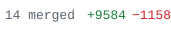
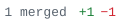

Hi, I'm **Phu** — I work on computer vision, and build the systems around it.

### Contributions

<!-- os:start -->
 
- [`#614`](https://github.com/roboflow/trackers/pull/614)&nbsp;&nbsp;|&nbsp;   fix(ocsort): encode ORU virtual boxes with `bbox_to_measurement` for XCYCWH&nbsp;&nbsp;|&nbsp; 
- [`#613`](https://github.com/roboflow/trackers/pull/613)&nbsp;&nbsp;|&nbsp; fix(base): reject non-finite boxes before `update()` mutates  tracker state&nbsp;&nbsp;|&nbsp; 

 
- [`#1561`](https://github.com/roboflow/rf-detr/pull/1561)&nbsp;&nbsp;|&nbsp; fix(training): record `args` and `model_config` in `last.ckpt` and interval checkpoints&nbsp;&nbsp;|&nbsp; 
- [`#1556`](https://github.com/roboflow/rf-detr/pull/1556)&nbsp;&nbsp;|&nbsp; fix(export): check export arguments and packages before the forward pass&nbsp;&nbsp;|&nbsp; 
- [`#1551`](https://github.com/roboflow/rf-detr/pull/1551)&nbsp;&nbsp;|&nbsp; fix(datasets): decode non-JPEG training images without a NumPy round trip&nbsp;&nbsp;|&nbsp; 
- [`#1546`](https://github.com/roboflow/rf-detr/pull/1546)&nbsp;&nbsp;|&nbsp; fix(export): check TRTInference inputs, TensorRT failures and its device&nbsp;&nbsp;|&nbsp; 
- [`#1543`](https://github.com/roboflow/rf-detr/pull/1543)&nbsp;&nbsp;|&nbsp; fix(models): reload the trained backbone from a `backbone_lora=True` checkpoint&nbsp;&nbsp;|&nbsp; 
- [+9 more →](https://github.com/roboflow/rf-detr/pulls?q=is%3Apr+is%3Amerged+author%3Althphuw)

 
- [`#174`](https://github.com/sunsmarterjie/yolov12/pull/174)&nbsp;&nbsp;|&nbsp; Fix DataLoader collate crash when a batch mixes background and labelled images&nbsp;&nbsp;|&nbsp; 
<!-- os:end -->
